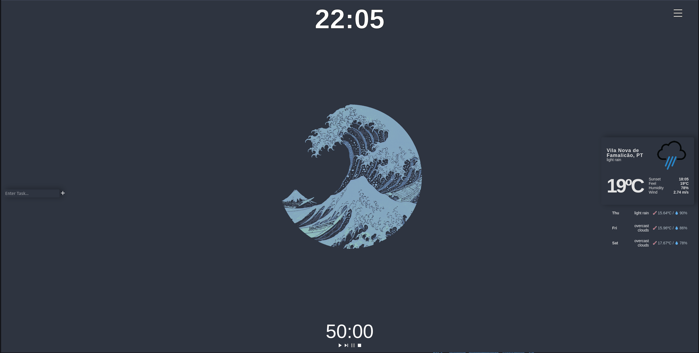

# Homepage App

A small pretty homepage that fills your 'todo' list and pomodoro needs.



# Add functionality for weather

You may use the weather functionality if you add the following file in the directory:

```...homepage/src/components/Weather/api.js```

with the following text (you may get the API from openWeather and GeoAPI):

```
export const GEO_API_URL = 'https://wft-geo-db.p.rapidapi.com/v1/geo/cities';

export const WEATHER_API_URL = 'https://api.openweathermap.org/data/2.5';

export const WEATHER_API_KEY = 'API KEY HERE';

export const geoApiOptions = {
  method: "GET",
  headers: {
    "X-RapidAPI-Key": "GEOAPI KEY HERE",
    "X-RapidAPI-Host": "wft-geo-db.p.rapidapi.com",
  },
};
```

You may also want to test the website, you can also do that here:

https://nserus.github.io/Homepage/


